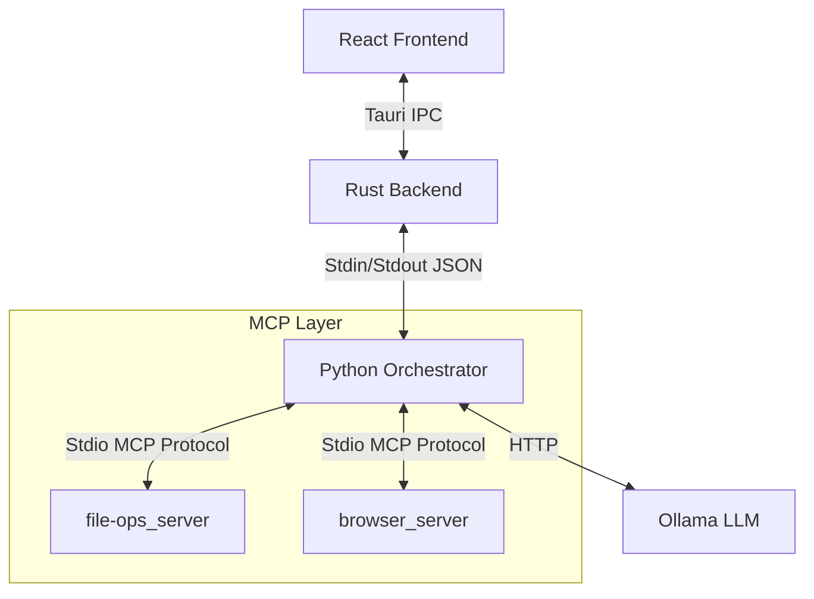

# MCP Desktop Host (Experimental Reference)

A modular desktop application that hosts Model Context Protocol (MCP) servers inside a local environment. Built with **Tauri** (Rust + React) for the frontend and **Python** for the AI orchestration layer.

**Purpose:** This is a technical proof-of-concept. It demonstrates how to decouple an AI interface from tool execution using the MCP standard, effectively recreating a "Claude Desktop" style architecture using entirely open-source components (Ollama, local Python).


## 🛠 Architecture

This application uses a **sidecar architecture**. The Tauri executable manages the window, while a persistent Python process handles the AI logic and tool orchestration.

**How MCP Fits In:**
Each server acts as an independent process exposing specific capabilities (tools) via the [Model Context Protocol](https://modelcontextprotocol.io/) `stdio` transport. The Python "Bridge" reads these schemas at runtime and routes LLM requests to the appropriate process.
Prebuilt binaries are provided for convenience and may lag behind the source code.


## ✅ Implemented Features
Local Inference: Connects to local Ollama instances (tested with Llama 3).

Orchestration Bridge: A Python client (bridge.py) that translates UI events into MCP tool calls.

Bundled MCP Servers:

file-ops: Basic filesystem interaction (List, Read, Write).

browser: Headless browser automation for fetching web content.

Path-Scoped Filesystem Access: Filesystem operations are restricted to a specific target directory (hardcoded in server.json or defined at runtime).

## 🚧 Planned / Roadmap
Permission UI: Currently, tools run without per-action user confirmation.

Dynamic Config: Ability to add/remove MCP servers via the UI (currently server.json only).

Streaming Tool Output: Real-time visibility into tool execution logs.

Production Packaging: Automating the inclusion of the Python runtime in the installer.

## ❌ Non-Goals
Replacing Production IDEs: This is not a code editor.

Remote Server Hosting: This is designed for local-first, privacy-focused execution.

Universal MCP Support: We currently support stdio transport only (no SSE/WebSocket support yet).

## ⚠️ Safety Warning
This project is intentionally incomplete and unsafe by default. It is meant for local experimentation only.

Browser Trust Model: The browser MCP server executes arbitrary navigation and scraping actions. It has full web access with no permission gating.

No OS Sandboxing: The filesystem protection is application-level path checking, not an OS-level sandbox.

## 🚀 Getting Started
Known Working Environment
OS: Windows 10/11 or macOS (Linux untested but likely compatible).

Python: 3.10+.

Node: v18+.

LLM Backend: Ollama running qwen2.5:latest.

1. Backend Setup (Python)
This project uses uv for dependency management, but standard pip works too.

```Bash

# Install Bridge dependencies
pip install -r requirements.txt

# Install MCP Server dependencies
cd file-ops_server && pip install .
cd ../browser_server && pip install .
Note: Ensure the paths in client/config/server.json match your actual virtual environment python executables.
```
2. Frontend Setup (Tauri)
```Bash

cd mcp-app
npm install
npm run tauri dev
```
### Python Dependencies

`requirements.txt` at the project root installs dependencies for the **Python bridge only**.

Each MCP server (`file-ops_server`, `browser_server`) manages its own dependencies separately.

3. Usage
Ensure Ollama is running (ollama serve).

Launch the app.

Type a request like: "Create a file named plan.txt in the data folder and write a summary of the latest AI news."

## Demo Video

https://github.com/user-attachments/assets/f446498a-845a-4564-ad5d-5854bfb3fa99

## ⚠️ Operational Limitations
Context Window: The bridge blindly dumps file contents into the context. Reading large files will crash the context window of smaller local models.

Concurrency: Tool calls are currently executed sequentially.

Packaging: The npm run tauri build command expects a specific directory structure for the Python sidecar. This is currently a manual configuration step and is not fully automated in CI/CD.

## 📁 Project Structure
```Plaintext

.
├── mcp-app/              # Tauri + React application
├── client/               # Python Orchestrator
│   ├── bridge.py         # IPC entry point
│   └── config/           # MCP Server Registry (server.json)
├── file-ops_server/      # MCP Server: Filesystem (Scoped)
└── browser_server/       # MCP Server: Headless Browser
```
